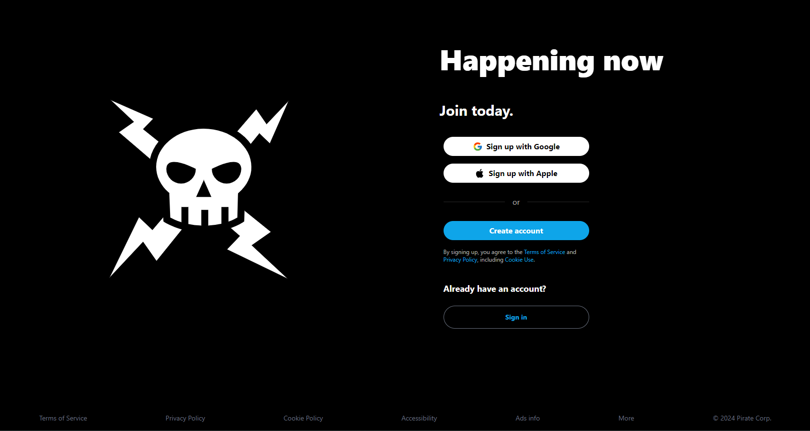
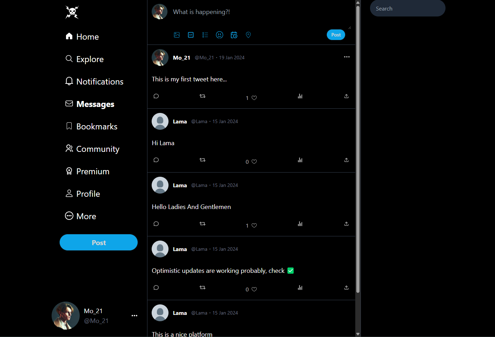
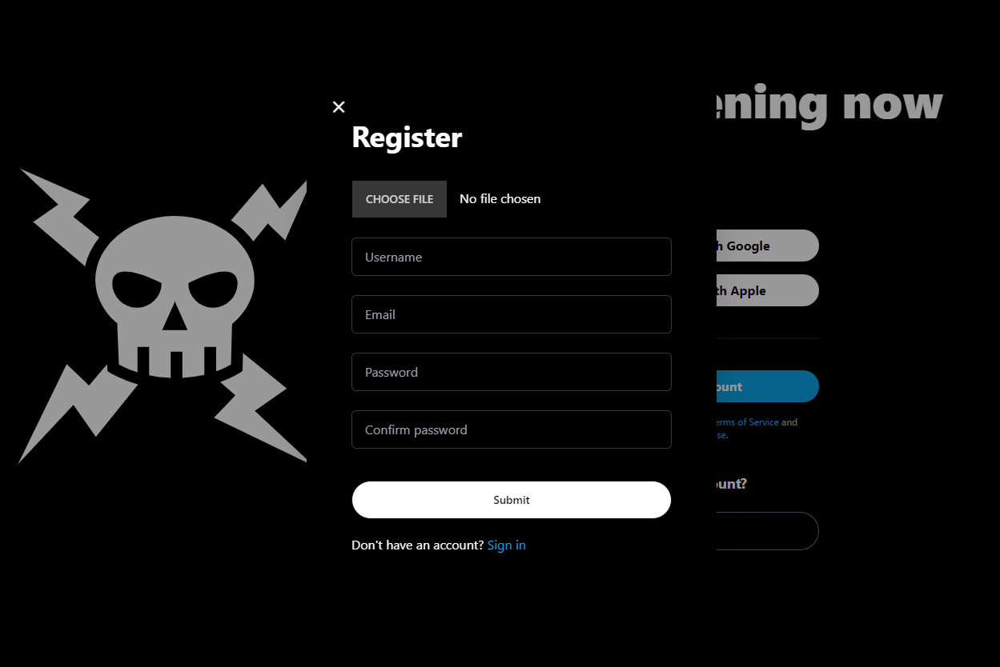

# Eddit

Eddit is a minimalist clone of Twitter, focusing on core features like user registration, login/logout, creating, deleting, and liking posts. It's built using a modern tech stack that includes React for the frontend and NestJS for the backend, all running within the Bun runtime environment and fully utilizing TypeScript for a robust development experience.



To examine the server code please see [Eddit-Server](https://github.com/Mo-21/Eddit-Server)

## Features

- User registration and authentication
- Login and logout functionality
- Create and delete posts
- Like posts
- Infinite scrolling of posts
- Optimistic updates for a seamless user experience



## Tech Stack

**Frontend:**

- **React**: For building a dynamic and responsive UI.
- **React Query**: For server state management, featuring infinite queries and optimistic updates.
- **Zustand**: For managing global state across the app.
- **DaisyUI**: For styling components with Tailwind CSS, providing a modern and clean UI design.



**Backend:**

- **NestJS**: A progressive Node.js framework for building efficient and scalable server-side applications.
- **Prisma**: Next-generation ORM for Node.js and TypeScript, used for database operations.
- **MySQL**: As the database, ensuring reliable storage and management of user data and posts.
- **Passport**: For handling authentication, integrated with JWT for secure token-based user authentication.
- **Uploadcare**: For handling media uploads, allowing users to enrich their posts with images and videos.

**Infrastructure:**

- **Docker**: For containerization, ensuring the application runs consistently across different environments.
- **Bun**: A modern JavaScript runtime like Node.js or Deno, but built for the edge, providing a faster and more efficient runtime environment.

## Getting Started

To get a local copy up and running, follow these simple steps.

### Prerequisites

- Docker
- Bun

### Installation

1. Clone the repo
   ```sh
   git clone https://github.com/Mo-21/Eddit.git
   ```
2. Navigate to the project directory
   ```sh
   cd Eddit
   ```
3. Use Docker to build and run the application

   ```sh
   docker-compose up --build
   ```

This will set up both the frontend and backend services, along with the MySQL database, all within Docker containers.

## Environment Variables

- DATABASE_URL - Your MySQL database connection string.
- JWT_SECRET - A secret key for JWT token encryption.
- VITE_UPLOADCARE_PUBLIC_KEY - Your public API key from Uploadcare.

## Usage

Once the application is running, you can access the frontend by navigating to http://localhost:5173 in your web browser. From there, you can register a new user account, log in, create posts, like posts, and delete your own posts.

## Contributing

Contributions are what make the open-source community such an amazing place to learn, inspire, and create. Any contributions you make are greatly appreciated.

## License

Distributed under the MIT License. See `LICENSE` for more information.
